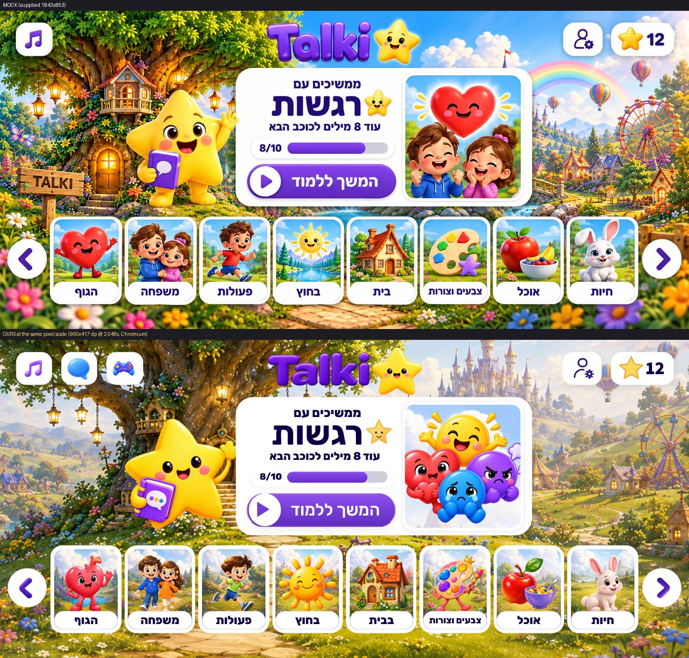
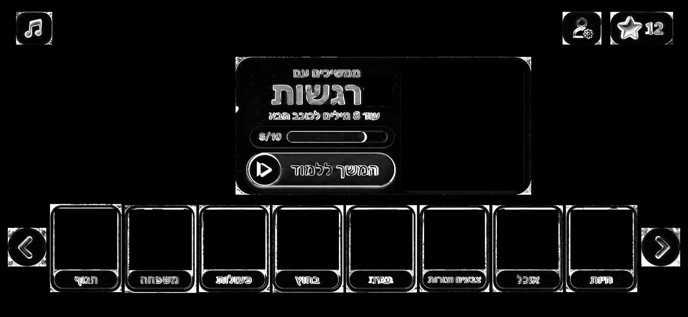
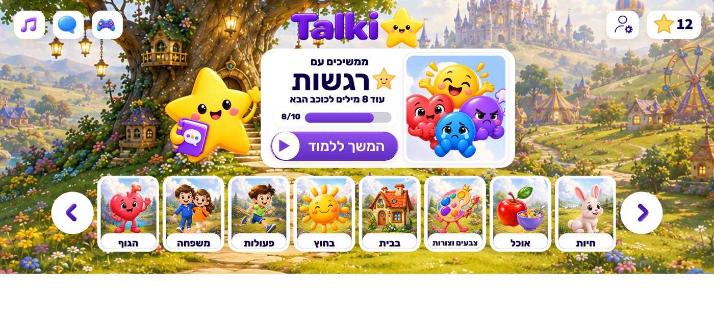
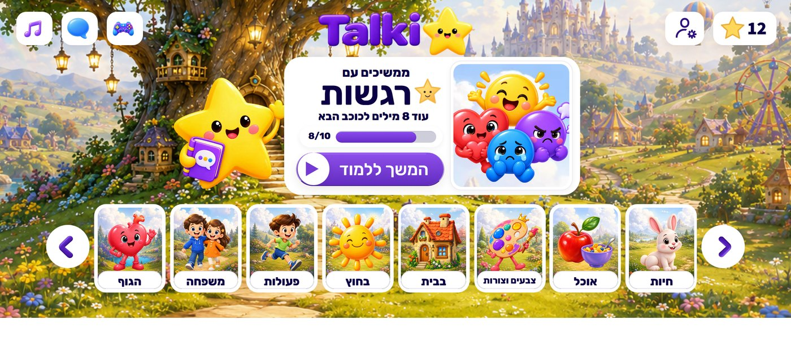

# Android Home — pixel-parity QA

Target: the supplied **1843 × 853** edge-to-edge mock
(`apps/mobile/assets/v3/mocks/mock_home_android_1843x853.png`), on an Android
landscape screen with the ad strip underneath. Branch `codex/android-home-mock-parity`
(PR #6). Status: **UI chrome matched to ±1–4 px; illustrations are art-blocked.**

## Result

| Measure | Before | After |
|---|---|---|
| Chrome error (masked MAE, 0–255) | 42.6 | **18.1** |
| Header buttons / hero plate / copy / CTA / arrows | 28.7 / 35.1 / 40.6 / 44.3 / 39.5 | 18.1 / 12.8 / 14.6 / 19.2 / 16.5 |
| Text & glyph best-fit offset vs mock (eyebrow, title, subtitle, "8/10", pill, glyphs) | 3–8 px | **0–1 px** (pill "12", play disc: 2 px) |
| Panel / CTA / arrows / header edges | up to 14 px | ≤ 2 px |

"Chrome" = the UI that is code (buttons, hero plate, progress, CTA, card frames,
label plates, arrows). Illustrations are excluded from that score because they are
different drawings from the mock's (see *Art*); a whole-image diff is ~54 and is
dominated by artwork. Remaining chrome error is soft shadows over a different
background, glyph shapes, and the mock's own inconsistency (its category cards
vary 187–192 px wide; ours are uniform).

## What changed (code)

All geometry is written as `px(<mock pixels>)` in `homeLayout.ts`, so every
constant sits next to the measurement it came from.

- **Header** — buttons drawn at the mock's 43 dp height (97 / 104 / 169 px wide,
  27 px radius), white, no lavender tint; mock inline insets; Rubik/Assistant
  digits. `LandscapeTouchSurface` keeps every tap box ≥ 48 dp while the drawn
  surface matches the mock (neighbours are laid out from the drawn size).
- **Profile glyph** — redrawn to the mock's proportions (larger head, open
  shoulders, solid toothed gear at the lower right, indigo `#2E117D`); also
  fixes the two lint errors that were failing CI.
- **Hero card** — pure white plate, 46 px radius, exact 792.5 × 371 px, thumbnail
  frame 328 × 349 px, 398 px copy column; Rubik type (eyebrow/subtitle 800,
  title 700, CTA 500) in the mock's `#0B0044` ink; top-anchored stack so each gap
  is tunable; fresh-user welcome stays centred, with a two-line subtitle. The title
  shrinks to fit (`fitTextSize`, floor 45 %) so long titles such as "צבעים וצורות" or
  the welcome "היי כאן דברי" never spill out of the card; "רגשות" keeps the mock's 44 dp.
- **Progress** — white pill 383 × 56 px, cool-grey recessed track `#CECEDB`,
  gradient fill `#8A4AEE → #672CC6`, count sized to the mock's ink.
- **CTA** — gradient `#8F50EC → #622CC0`, soft rim (firm at the bottom, faint at
  the ends, none on top), faint gloss line, 87 px white disc.
- **Category strip** — cards 191.5 × 238 px, frame 9.5 px, **label is the full
  inner width and flush on the inner bottom edge** (hairline separated), not a
  floating pill. Strip is sized to **exactly eight whole cards**; the
  arrow · strip · arrow group is centred, so a wider phone gets calm margins
  instead of a clipped ninth card. Arrows sit 4 px above the card centre line,
  chevron 28% larger and nudged 5 px toward its point, as in the mock.
- **Home category order** (Home only, `features/home/homeCategoryOrder.ts`): the
  mock's eight first (animals, food, colors, home, **outside**, actions, family,
  body); `numbers`, `emotions`, `mine` follow. Domain order is untouched.
- Hardening found while sweeping: `measureInWindow` null-dereference in
  `SortScreen` (×2) and `PuzzleScreen` (an Expo error overlay covered every screen
  after Sort). One optional-chain each.

## Art — DESIGN-BLOCKED (AGENTS.md #19)

These are **different drawings** in the mock from anything in `assets/v2|v3`.
They cannot be reached with CSS, and cropping them out of the mock would put a
screenshot into the app (AGENTS.md #4). Required, with the size the mock draws
each at (mock px → dp; deliver ≥ 3×, transparent where noted):

| Asset | Mock size | Notes |
|---|---|---|
| Home world background | 1843 × 853 | Tree at the start with the wooden **TALKI** sign, castle + rainbow + ferris wheel at the end, bridge/river centre-right. Needs a safe crop to ~2.5:1 (wider phones) |
| Mascot star | ≈ 299 × 316 (146 × 154 dp) | Standing on legs, waving, brown glossy eyes, holding the purple chat book. Transparent |
| Category art ×8 (+ numbers, emotions) | card interior 172 × 220 (84 × 107 dp) | Scene **baked in** (sky/meadow), art runs under the label. Replaces `category_bgN` + `category_*` pairing |
| Hero thumbnail (per category) | 309 × 330 (151 × 161 dp) | Emotions in the mock: two kids hugging a big heart |
| Glossy 3D star (header pill) | 64 × 61 | Ours is the flat outlined `talki-ui-icon-star` |
| Title star mark | 71 × 71 | Glossy kawaii star |
| Music glyph | 44 × 49 | Darker, taller glossy note; ours is wider/lighter |
| Arrow chevron | 37 × 59 | Thicker stroke than `talki-chevron-left` |

Dropping new files at the same registry keys in `design-system/assets.ts` is all
the code needs; positions/sizes above are already wired.

## Deliberate deviations from the mock

1. **Practice and Games buttons stay** beside the music button (mock draws only
   music). They are Home's only route to those hubs (AGENTS.md #6), drawn in the
   same chrome. Say the word if you would rather relocate them.
2. **Home label "בבית"** — the domain title is `בַּבַּיִת`; the mock draws "בית".
   Changing it would rename the category screen and break its tests, so it is
   left for a content decision.
3. Play triangle has sharp corners (RN cannot round a border-triangle); the
   mock's is softly rounded.
4. Muted music dims the glyph (mock shows only the "on" state).

## Method

Chromium via Playwright, 900 × 467 css @ DSF 1843/900, so **1 screenshot px =
1 mock px**; progress seeded to the mock's state (12 stars, emotions 8/10, ad
reserved). Tools in `apps/mobile/tools/home-fidelity/`:

| Tool | Use |
|---|---|
| `pixel-capture.mjs <tag>` | render + element rects |
| `align_report.py <stage.png>` | **best-fit dx/dy per text/glyph** (trust this over boxes) |
| `pixel_report.py` | chrome box edges vs mock |
| `chrome_diff.py` | masked MAE + heatmap |
| `compare_crop.py`, `dom-dump.mjs` | zoom crops, DOM rects in mock px |
| `device-sweep.mjs home\|all` | Pixel 9 / iPhone 17 Pro / Pixel 9 Pro |
| `contact_sheet.py <device>` | one sheet per 12 screens |

Sign convention (easy to get backwards — I did): in `align_report`, positive
`dx` = capture is **left** of the mock, positive `dy` = **higher**.

## Device validation (Chromium, landscape, ad reserved)

Project rule: Playwright/Chromium checks run on **Pixel 9** and **iPhone 17
Pro** (Pixel 9 Pro added — it is the size the mock was first reviewed at). The
canvas rig above is only a measuring instrument. Viewport = full landscape
screen (native app, no browser chrome); 50 px banner slot reserved.

| Device | Screen | Stage | 8 whole cards | Doc scroll | Cards → ad |
|---|---|---|---|---|---|
| Pixel 9 | 808 × 360 | 808 × 310 | yes | none | 24.5 px |
| iPhone 17 Pro | 874 × 402 | 874 × 352 | yes | none | 27.9 px |
| Pixel 9 Pro | 952 × 427 | 952 × 377 | yes | none | 29.8 px |

The stage scales uniformly from the mock's canvas and sits above the banner; the
mock's 32 dp bottom margin becomes the air between cards and ad. Not covered:
iOS safe-area insets (Chromium cannot emulate them).

Every other screen, on both devices: `screenshots/android-home/all-screens-*`.
Backlog: [android-pages-plan.md](android-pages-plan.md).

## CI

Green locally: `tsc`, `eslint` (0 errors, 0 warnings), Vitest (**5,579 tests**,
28 new), and the web export. Playwright, run against the exported bundle:

- full E2E tier on landscape-844 + landscape-932: **305 passed, 70 failed** — all
  70 are `toHaveScreenshot` mismatches (below); every behavioural test passes;
- Home / shell / navigation / ad-layout / sort / puzzle specs on the *final* code,
  four projects (compact-phone, 844, 932, tablet-16:10): **152 passed, 9 failed** —
  8 are the Home / landscape-shell `toHaveScreenshot` baselines this redesign
  intentionally changes; 1 (`empty-progress Home baseline`, 932) failed under load
  and passes alone.
- Home composition, touch-target and reachability audits, ad separation, arrows,
  resize (5 viewports) and every header control are among the passing tests.

Not green, and not caused by this PR: **every `toHaveScreenshot` baseline in the
E2E tier fails** (70 = 35 × 2 projects here; Home was 73 % different, the quiz
done card 38 %). CI has failed at E2E since Phase 28 and at Lint since the Home
rebuild; lint is now fixed. Baselines were stale before this work and the
snapshot template has no `{platform}`, so PNGs made on Windows cannot match the
Linux runner. Fix = regenerate them **on Linux**. A local Docker attempt did not
work (Docker Desktop 4.41.2's backend crashes on start with a stale
`%LOCALAPPDATA%\Docker\run\dockerInference` socket it cannot delete; nothing was
changed on the machine). Implemented instead, no local install:
`.github/workflows/update-e2e-baselines.yml` runs on `ubuntu-latest`, regenerates
every baseline against the exported bundle, re-runs the full suite *without*
updating (as `Mobile` does), and only if that is green commits the PNGs under
`apps/mobile/tests/e2e/__screenshots__` to the branch.

To use it: push the branch, then **add the label `update-e2e-baselines` to the PR**
(create the label on first use). It is removed when the job ends, so it can be
re-applied. (Actions-tab "Run workflow" only appears once the file is on the
default branch.) Commits made with `GITHUB_TOKEN` do not start other workflows,
so afterwards re-run `Mobile` on the branch. Not yet run — it needs GitHub, so its
first run is the real test; the job's report artifact holds the diffs if it fails.

Run E2E against the exported bundle, not Metro: `npm run export:web && npx
playwright test` (the dev bundle never reaches `load` inside 30 s).
